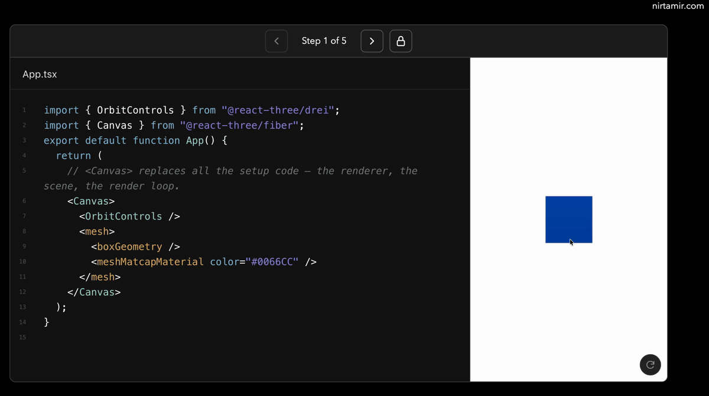

# slidev-addon-sandpack

[](https://www.npmjs.com/package/slidev-addon-sandpack)
[](https://github.com/nirtamir2/slidev-addon-sandpack/actions/workflows/ci.yml)
[](https://pkg.pr.new/~/nirtamir2/slidev-addon-sandpack)
[](./LICENSE)

Build stepped, multi-file [CodeSandbox Sandpack](https://sandpack.codesandbox.io/) live-code demos in [Slidev](https://sli.dev/) from readable Markdown.



## Install

```bash
pnpm add slidev-addon-sandpack
# npm install slidev-addon-sandpack
# yarn add slidev-addon-sandpack
# bun add slidev-addon-sandpack
```

Activate the addon in the headmatter of your Slidev entry file:

```yaml
---
addons:
  - slidev-addon-sandpack
---
```

## Quick start

Use a four-backtick `sandpack` fence for the demo and a normal Slidev code-block title for each filename:

`````md
````sandpack

```tsx [App.tsx]
export default function App() {
  return <h1>Hello from Sandpack</h1>;
}
```

````
`````

The filename is required. `App.tsx`, `/App.tsx`, and `./App.tsx` all resolve to `/App.tsx`.

## Progressive steps

Add the formatter-safe `<!-- sandpack:step -->` comment between steps. Each step starts with the fully resolved files from the previous step, then replaces or adds the files it declares.

`````md
````sandpack

```tsx [App.tsx]
export default function App() {
  return <h1>Step one</h1>;
}
```

<!-- sandpack:step -->

```tsx [Card.tsx]
export function Card() {
  return <article>Added in step two</article>;
}
```

```tsx [App.tsx]
import { Card } from "./Card";

export default function App() {
  return <Card />;
}
```

````
`````

The first file declared in a step becomes its active file. File deletion is intentionally not supported in version 1.

## Reusable presets

Create `sandpack.config.ts` beside the deck's entry Markdown file:

```ts
import { defineSandpackConfig } from "slidev-addon-sandpack";

export default defineSandpackConfig({
  defaultPreset: "r3f",
  theme: "dark",
  presets: {
    r3f: {
      template: "react-ts",
      dependencies: {
        three: "^0.176.0",
        "@react-three/fiber": "^9.1.2",
      },
      entry: "/index.tsx",
      files: {
        "/index.tsx": {
          source: "./sandpack/index.tsx",
          hidden: true,
        },
        "/styles.css": {
          source: new URL("./sandpack/styles.css", import.meta.url),
          hidden: true,
          readOnly: true,
        },
      },
      layout: {
        editorSize: 65,
        minHeight: "24rem",
      },
    },
    physics: {
      extends: "r3f",
      dependencies: {
        "@react-three/rapier": "^2.1.0",
      },
    },
  },
});
```

The top-level `theme` applies to every demo in the deck. It accepts Sandpack's
`"dark"` (the default), `"auto"` adaptive mode, or `"light"`, as well as native
custom theme objects. Catalog themes from `@codesandbox/sandpack-themes` can be
installed separately and passed as objects. See the
[preset guide](./docs/presets.md#deck-theme) for examples.

Select a named preset after the opening delimiter:

`````md
````sandpack physics

```tsx [App.tsx]
export default function App() {
  return <PhysicsDemo />;
}
```

````
`````

See [docs/presets.md](./docs/presets.md) for inheritance, merge rules, source-backed files, layouts, and shareable preset packages.

Maintainers can follow [docs/releasing.md](./docs/releasing.md) for the npm trusted-publishing setup, release tags, provenance, and Slidev gallery discovery.

## Runtime controls

Every demo provides:

- Icon-only previous/next step controls with boundary states, accessible labels,
  native tooltips, and a live step announcement.
- Read-only and editable modes through an action icon: the pencil enables
  editing, and the lock enables read-only mode.
- Sandpack file tabs, editor diagnostics, and preview refresh controls.
- Keyboard isolation so editor input does not trigger Slidev navigation.
- A contained error state if the embedded renderer fails.

### Customize addon controls

The addon-owned control bar exposes semantic data attributes and empty CSS
classes. Bundled control styles use low-specificity data selectors. Button and
SVG defaults include only element specificity so they survive Slidev resets,
while a normal consumer class selector still overrides them without
`!important`.

| Element         | CSS hook                                     | Data contract                                                          |
| --------------- | -------------------------------------------- | ---------------------------------------------------------------------- |
| Control group   | `.slidev-sandpack__controls`                 | `data-slidev-sandpack-part="controls"`, state `read-only` or `editing` |
| All buttons     | `.slidev-sandpack__control-button`           | part `control-button`, action, and state attributes                    |
| Previous button | `.slidev-sandpack__control-button--previous` | action `previous-step`, state `enabled` or `disabled`                  |
| Next button     | `.slidev-sandpack__control-button--next`     | action `next-step`, state `enabled` or `disabled`                      |
| Mode button     | `.slidev-sandpack__control-button--mode`     | action `toggle-edit`, state `read-only` or `editing`                   |
| Control icon    | `.slidev-sandpack__control-icon`             | part `control-icon`, icon name                                         |
| Step status     | `.slidev-sandpack__step-status`              | part `step-status`, current step, and step count                       |

Every action and state value is available through
`data-slidev-sandpack-action` and `data-slidev-sandpack-state`. The status uses
1-based `data-slidev-sandpack-step` and `data-slidev-sandpack-step-count`
values. Icons expose `data-slidev-sandpack-icon` as `arrow-left`,
`arrow-right`, `pencil`, or `lock`. Buttons contain no visible text, while
native `aria-label` and `title` attributes preserve their action names.
Native `disabled` and ARIA attributes remain the behavioral and accessibility
source of truth.

```css
.slidev-sandpack__control-button {
  border-radius: 999px;
}

.slidev-sandpack__control-button[data-slidev-sandpack-state="disabled"] {
  opacity: 0.25;
}
```

These hooks cover only addon-owned controls. Sandpack-owned editor and preview
internals retain Sandpack's own styling contract.

## Compatibility

- Node.js `>=24.0.0`
- Slidev `>=52.1.0`
- React and React DOM `>=18 <20`
- Vue `>=3.4.0`

React and React DOM are peer dependencies. The addon deduplicates them through Vite and does not require `slidev-addon-react`.

## Important behavior

- Slidev treats preparsers as an advanced feature. They can affect editor integrations because the syntax is transformed before normal Markdown rendering.
- After installing or changing preparser setup code, fully stop and start Slidev; a hot restart may not be sufficient.
- Changes to `sandpack.config.ts` or source-backed preset files restart the development server so compiled slide data cannot become stale.
- Sandpack downloads dependencies and runs the preview through CodeSandbox's browser bundler. Do not put secrets, private tokens, or server-only credentials in demo files.
- Source-backed preset files are local build-time files only. Remote `http:` and `https:` source URLs are rejected.

## Troubleshooting

### A fence is rejected

Every fence needs one bracketed filename, such as `tsx [App.tsx]`. Duplicate aliases like `App.tsx` and `/App.tsx` in one step are rejected after normalization.

### A custom entry is missing

When a preset defines `entry`, that file must exist after preset and authored files are resolved for every step.

### The preview cannot install a package

Check the dependency name/version in the selected preset and the browser network console. Sandpack dependency installation requires network access.

## Migrating from the original talk syntax

Replace generated `FilesPlayground` payloads or fences with manual `index`/`file` attributes with a four-backtick `sandpack` fence. Put each file path in the fence title and replace index changes with `<!-- sandpack:step -->`. Move shared entry files, styles, and dependency maps into a named preset.

## Development

```bash
corepack enable
pnpm install
pnpm run check
pnpm run test:pack
```

See [CONTRIBUTING.md](./CONTRIBUTING.md) for the development workflow and pull-request expectations.

The package is released under the [MIT License](./LICENSE).
